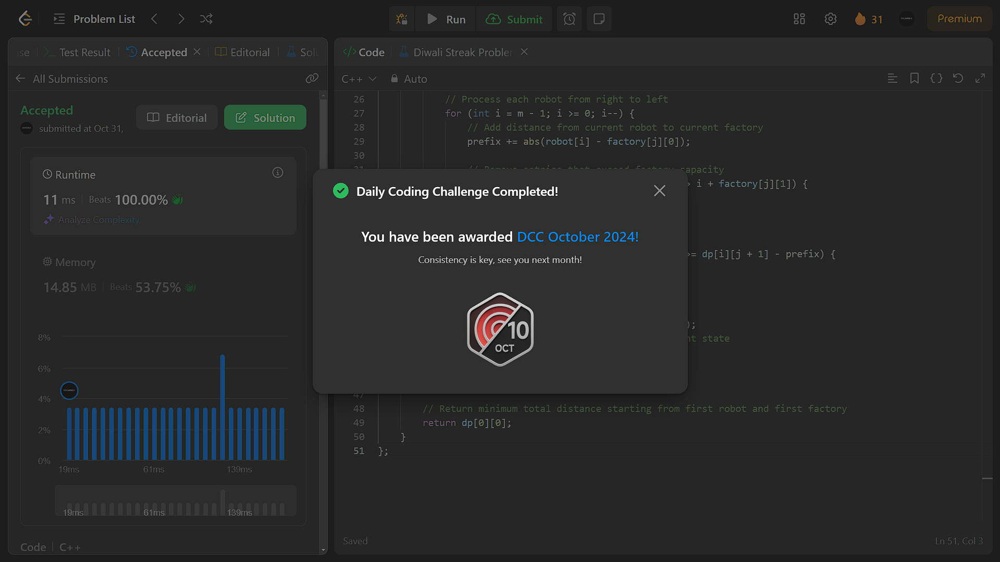

# October-LeetCoding-Challenge-2024-Solution

Welcome to the **October LeetCoding Challenge 2024** repository! This repo is dedicated to providing daily solutions for each challenge question along with the question links, making it easier for LeetCoders to learn and follow along.

## About
This repository contains:
- Solutions to each day's question in the **October 2024 LeetCoding Challenge**.
- Links to the original LeetCode questions, allowing you to quickly access the problem statement and try it out on your own.

## Structure
Each day’s challenge will be organized in its own file, containing:
- The question link.
- A well-commented solution to help you understand the approach.

## Repository Goals
This repo is designed to help:
- **LeetCode enthusiasts** who want a quick reference for daily challenges.
- **Learners** looking to improve their problem-solving skills with clear and structured solutions.
  
## How to Use
1. Clone or download this repository.
2. Navigate to the folder for the specific day you want to view.
3. Each file will include the question link and solution.

## Contributing
Feel free to suggest improvements or alternative solutions by creating a pull request. Contributions are always welcome!

## License
This repository is licensed under the MIT License. Feel free to use the solutions for learning purposes.

Happy coding and best of luck with the October LeetCoding Challenge!

